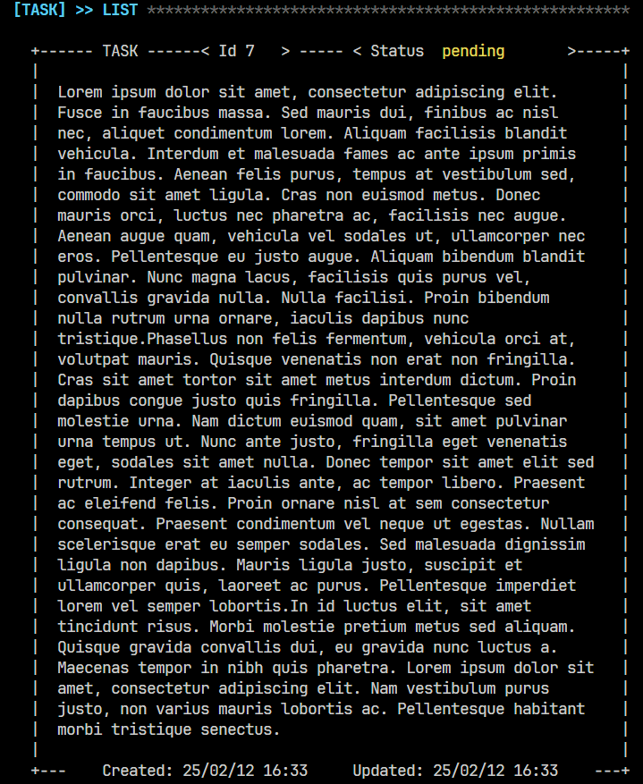
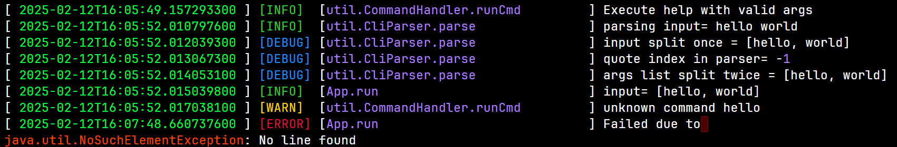
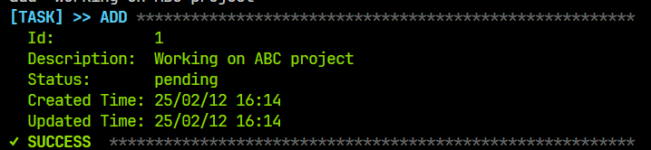
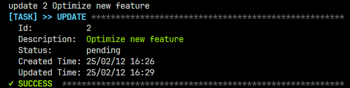
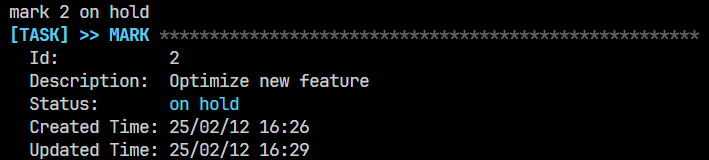
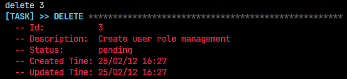
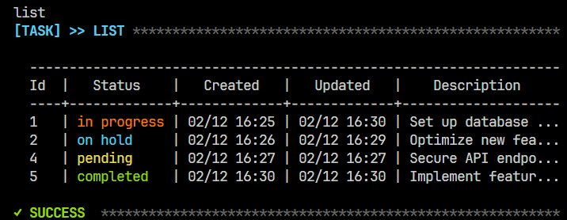
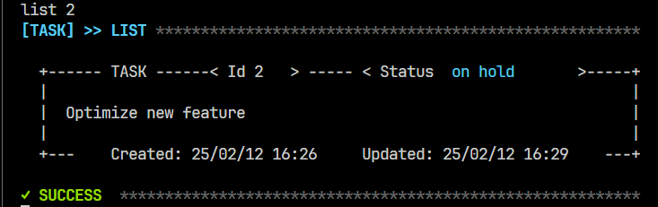

# TASK MANAGER

## [日本語説明書](docs/Docs_JA.md)

# Task Tracker Command Line Interface
Simple task tracker to track what you need to do, what you have done, and what you are currently working on.
### Table of Contents
- [Feature](#feature)
- [Installation](#installation)
- [Usage](#usage)
- [Demo](#demo)
- [Requirement](#Requirement)＃＃
## Feature
1) Render long description task

2) Logger

3) Language support for Japanese and English

## Installation
See [Requirement](#Requirement) 
```bash
git clone https://github.com/Larry-Tomson/task-manager-cli-public.git
cd task-manager-cli-public
mvn clean install
```

## Usage
Passing Command-Line Arguments:
```bash
    mvn package
    java -jar target/task-manager-{version}.jar <arguments>
```
*example*
```bash
java -jar target/task-manager-1.2.0.jar help
java -jar target/task-manager-1.2.0.jar add "hello world"
java -jar target/task-manager-1.2.0.jar mark 1 completed
java -jar target/task-manager-1.2.0.jar delete 1
```

Interactive mode

```bash
    mvn clean install
    java -jar target/task-manager-{version}.jar
```
*example*
```bash
    help
    add "hello world"
    mark 1 completed
    delete 1
```

## Demo
1) Add new task

2) Update current task

3) Mark status

4) delete

5) List all

6) List by id



## Requirement
### Run environment
- **Java Development Kit (JDK) 11 or later**  
  The project requires JDK 11 or above.  
  - [Download OpenJDK](https://jdk.java.net/)
  - [Oracle JDK](https://www.oracle.com/java/technologies/javase-jdk11-downloads.html).

- **Apache Maven 3.6.0 or later**  
  Maven is used to manage the project build lifecycle and dependencies.  
  [Maven Installation Guide](https://maven.apache.org/install.html)

### Vscode support
#### Japanese support for vscode integrated terminal
```json
"terminal.integrated.profiles.windows": {
        "PowerShell": {
            "source": "PowerShell",
            "icon": "terminal-powershell",
            "args": [
                "-NoExit",
                "/c",
                "chcp.com 65001"
            ]
        },
        "Command Prompt": {
            "path": [
                "${env:windir}\\Sysnative\\cmd.exe",
                "${env:windir}\\System32\\cmd.exe"
            ],
            "args": [
                "-NoExit",
                "/c",
                "chcp.com 65001"
            ],
            "icon": "terminal-cmd"
        },
        "Git Bash": {
            "source": "Git Bash",
            "env": {
                "LANG": "C.UTF-8"
            },
            "args": [
                "-c",
                "chcp.com 65001;bash"
            ]
        }
    },
```

#### Color support for log file in vscode
Add the following text rules to `./setting.json` in your vscode.
```json
 "editor.tokenColorCustomizations": {
        "textMateRules": [
            {
                "scope": "editorCodeLens",
                "settings": {
                    "foreground": "#FF0000",
                    "fontStyle": "bold"
                },
            },
            {
                "scope": "log.info",
                "settings": {
                    "foreground": "#32CD32"
                }
            },
            {
                "scope": "log.warning",
                "settings": {
                    "foreground": "#FFD700"
                }
            },
            {
                "scope": "log.debug",
                "settings": {
                    "foreground": "#1E90FF"
                }
            },
            {
                "scope": "log.error",
                "settings": {
                    "foreground": "#DC143C"
                }
            },
            {
                "scope": "log.trace",
                "settings": {
                    "foreground": "#D3D3D3"
                }
            },
            {
                "scope": "log.exception",
                "settings": {
                    "foreground": "#8B008B"
                }
            },
            {
                "scope": "log.exceptiontype",
                "settings": {
                    "foreground": "#FF4500"
                }
            },
            {
                "scope": "entity.name.type.enum",
                "settings": {
                    "foreground": "#B8D7A3"
                }
            },
            {
                "scope": "comment",
                "settings": {
                    "foreground": "#00FF41"
                }
            },
            {
                "scope": "entity.name.type",
                "settings": {
                    "foreground": "#269da5"
                }
            },
            {
                "scope": "entity.name.type.interface",
                "settings": {
                    "foreground": "#B8D7A3"
                }
            }
        ]
    },
```


