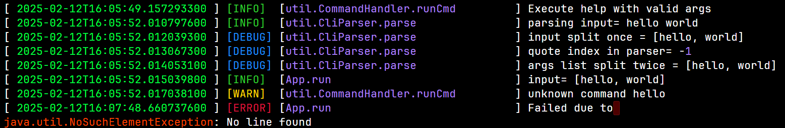
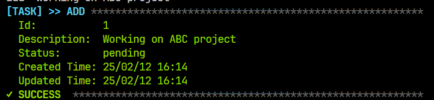
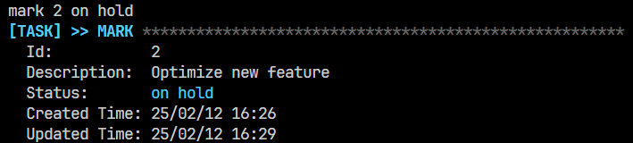
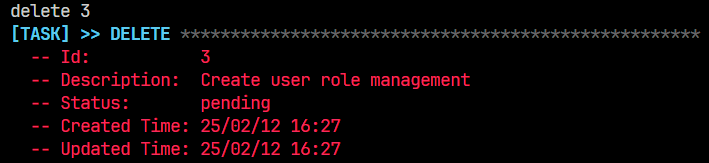
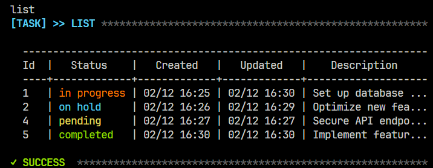

# タスクトラッカー コマンドラインインターフェース

やるべきこと、完了したこと、そして現在取り組んでいることを管理するシンプルなタスクトラッカーです。

### 目次
- [機能](#機能)
- [インストール](#インストール)
- [使用方法](#使用方法)
- [デモ](#デモ)
- [要件](#要件)

## 機能
1) タスクの詳細説明を表示  
   

2) ロガー機能  
   

3) 日本語と英語の言語サポート

## インストール
詳細は[要件](#要件)を参照してください

```bash
git clone https://github.com/Larry-Tomson/task-manager-cli-public.git
cd task-manager-cli-public
mvn clean install
```

## 使用方法

### コマンドライン引数を渡す場合
```bash
    mvn package
    java -jar target/task-manager-{version}.jar <arguments>
```

*例*
```bash
java -jar target/task-manager-1.2.0.jar help
java -jar target/task-manager-1.2.0.jar add "hello world"
java -jar target/task-manager-1.2.0.jar mark 1 completed
java -jar target/task-manager-1.2.0.jar delete 1
```

### インタラクティブモード

```bash
    mvn clean install
    java -jar target/task-manager-{version}.jar
```

*例*
```bash
help
add "hello world"
mark 1 completed
delete 1
```

## デモ
1) 新規タスクの追加  
   

2) 現在のタスクの更新  
   

3) ステータスの変更  
   

4) タスクの削除  
   

5) すべてのタスクを表示  
   

6) ID指定でタスクを表示  
   

## 要件

### 実行環境

- **Java Development Kit (JDK) 11以上**  
  本プロジェクトの実行にはJDK 11以上が必要です。  
  - [OpenJDKのダウンロード](https://jdk.java.net/)
  - [Oracle JDK](https://www.oracle.com/java/technologies/javase-jdk11-downloads.html)

- **Apache Maven 3.6.0以上**  
  Mavenはプロジェクトのビルドライフサイクルおよび依存関係の管理に使用されます。  
  [Mavenのインストールガイド](https://maven.apache.org/install.html)

### VSCodeサポート

#### VSCode 統合ターミナルの日本語サポート
```json
"terminal.integrated.profiles.windows": {
        "PowerShell": {
            "source": "PowerShell",
            "args": [
                "chcp.com 65001"
            ]
        },
        "Command Prompt": {
            "args": [
                "chcp.com 65001"
            ],
        },
        "Git Bash": {
            "source": "Git Bash",
            "env": {
                "LANG": "C.UTF-8"
            },
            "args": [
                "-c",
                "chcp.com 65001;bash"
            ]
        }
    },
```
#### VSCode でのログファイルのカラーサポート
VSCode の `./setting.json` に以下の文字ルールを追加してください。

```json
 "editor.tokenColorCustomizations": {
        "textMateRules": [
            {
                "scope": "editorCodeLens",
                "settings": {
                    "foreground": "#FF0000",
                    "fontStyle": "bold"
                },
            },
            {
                "scope": "log.info",
                "settings": {
                    "foreground": "#32CD32"
                }
            },
            {
                "scope": "log.warning",
                "settings": {
                    "foreground": "#FFD700"
                }
            },
            {
                "scope": "log.debug",
                "settings": {
                    "foreground": "#1E90FF"
                }
            },
            {
                "scope": "log.error",
                "settings": {
                    "foreground": "#DC143C"
                }
            },
            {
                "scope": "log.trace",
                "settings": {
                    "foreground": "#D3D3D3"
                }
            },
            {
                "scope": "log.exception",
                "settings": {
                    "foreground": "#8B008B"
                }
            },
            {
                "scope": "log.exceptiontype",
                "settings": {
                    "foreground": "#FF4500"
                }
            },
            {
                "scope": "entity.name.type.enum",
                "settings": {
                    "foreground": "#B8D7A3"
                }
            },
            {
                "scope": "comment",
                "settings": {
                    "foreground": "#00FF41"
                }
            },
            {
                "scope": "entity.name.type",
                "settings": {
                    "foreground": "#269da5"
                }
            },
            {
                "scope": "entity.name.type.interface",
                "settings": {
                    "foreground": "#B8D7A3"
                }
            }
        ]
    },
```
